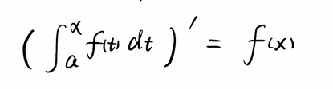
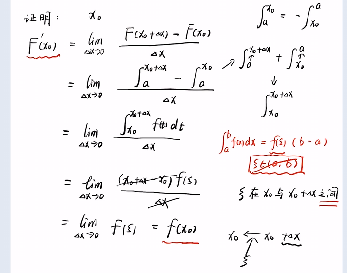
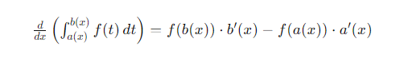

## 变限积分

变限积分有意思的地方在于他的变量是上下限

## 变限积分的求导
1. 上限为x, 下限为常数的求导
公式如下

公式可以用导数定义+积分中值定理证, 视频丢ref里

2. 上限为x的函数的求导
链式法则

3. 上下限均是函数
莱布尼兹公式不解释
要求被积函数里没有变量x
公式如下

如果有变量x, 似乎数分里面有一个拓展公式, emmmm, 我懒得记

4. 隐函数
左右求导即可

5. 参数方程
按参数方程求导即可

6. 被积函数里有x的情况
x在积分区间里可以作为一个常数来看待
但是很多时候需要换元才能拆出来

## 几何意义
似乎可以看作是计算曲线下的面积在区间内的变化率

## 特殊情况
当下限为0, 上限为x的时候
可以看作是被积函数的原函数

## ref
[变限积分](https://www.bilibili.com/video/BV1Hv411z7zr)